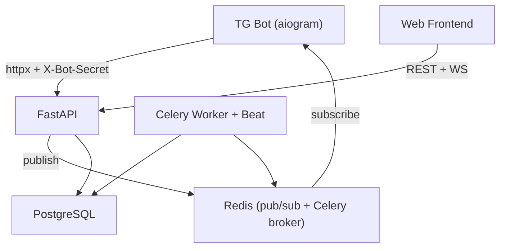

# Production Readiness Roadmap — ALYAFBMP Marketplace

## Architecture Overview



---

## SECTION 1 — Critical Missing Features (App-Breaking Blockers)

### 1.1 `communication/router.py` — Catastrophic Import Bug
**File:** `backend/apps/communication/router.py`, line 9

```python
from apps.bot.botkeyboard import router  # BUG: this IS the botkeyboard router
```
`router` is never declared as `APIRouter()`. All chat/WS routes (`/chats`, `/ws/chat/{id}`) are registered onto the **Telegram bot's** router. The communication module is entirely broken.

**Fix:** Replace with `router = APIRouter()`.

### 1.2 `auth/router.py` — Wrong Import Path
```python
from moderation.deps import soft_verify_bot_secret  # ImportError at startup
```
**Fix:** `from apps.moderation.deps import soft_verify_bot_secret`

### 1.3 `auth/schemas.py` — TokenResponse Field Name Mismatch
Schema declares `access: str` and `refresh: str`, but `login` endpoint returns:
```python
TokenResponse(access_token=..., refresh_token=...)  # fields don't exist → ValidationError
```
**Fix:** Align field names in schema (`access_token`, `refresh_token`) or fix the return call.

### 1.4 `common/deps.py` — `get_current_user_id_optional` Always Returns `None`
```python
# TODO Група 1: поки що ігноруємо переданий токен.
return None
```
This means the smart feed **never** personalizes for logged-in users and `POST /products/{id}/like` silently fails ownership checks.

### 1.5 `communication/router.py` — Wrong WebSocket Auth Signature
```python
user_id = await get_current_user_id(token, db)  # Wrong: expects HTTPAuthorizationCredentials
```
`get_current_user_id` takes `HTTPAuthorizationCredentials | None`, not a raw string. WebSocket auth will always raise a `TypeError`.

### 1.6 `bot.py` — `listen_to_redis_task` is Broken Code
- `redis` is never imported (`from redis.asyncio import Redis`)
- `redis.pubsub()` should be `r.pubsub()` (wrong object)
- `await redis.pubsub.subscribe(...)` should be `await pubsub.subscribe(...)`
- `pubsub.get_message(...)` is not awaited
- Payload key mismatch: bot reads `image_url` (singular), service publishes `images` (list)
- `ignore_subscribe_menu=True` → typo, should be `ignore_subscribe_messages=True`

### 1.7 `products/services/feed.py` — Absolute Import Will Fail
```python
from backend.common.models import ...  # fails when run from backend/ directory
```
**Fix:** `from common.models import ...`

### 1.8 `orders/router.py` — Missing `import logging`
`logging.error(...)` called without `import logging` → `NameError` at runtime.

### 1.9 `.env_dev` — `BOT_SECRET` Key Typo
`.env_dev` has `BOT_SECERT=...` (misspelling). `settings.BOT_SECRET` reads `BOT_SECRET`, so the key is never loaded. Bot secret validation will always fail in the dev environment.

---

## SECTION 2 — Architecture Weaknesses

### 2.1 No Ban Enforcement at Auth Layer
`get_current_user_id` queries the user from DB but **never checks `banned_until`**. A banned user with a valid JWT continues to access all endpoints.

### 2.2 WebSocket ConnectionManager is In-Process Only
`ws_manager.py` stores connections in a Python `dict`. With >1 uvicorn worker, users on different workers can't reach each other. Needs a Redis pub/sub broadcast layer.

### 2.3 No Message Persistence in WebSocket Handler
`chat_websocket` broadcasts in real-time but **never writes to `messages` table**. Chat history is lost on reconnect. The `Message` ORM model exists but is never used.

### 2.4 No Chat Authorization (Ownership)
WebSocket endpoint: any authenticated user can connect to `ws/chat/{any_chat_id}`. There is no check that `user_id in {chat.buyer_id, chat.seller_id}`.

### 2.5 `ProductDetailResponse` Schema Drift
`products/schemas.py` defines `ProductDetailResponse` without `created_at`, `category_name`, or `images` fields, but `product_detail` endpoint constructs it with those fields. This will raise a Pydantic `ValidationError` in strict mode or silently drop fields.

### 2.6 `FeedItem` Schema Drift
`FeedItem` schema has only `{id, title, price, is_priority}` but `fetch_smart_feed` returns dicts with `status`, `category`, `seller`, `images`, `created_at`. Frontend receives minimal data; full object is stripped.

### 2.7 Celery `clear_expired_bans` Not Implemented
```python
async with AsyncSessionLocal() as session:
    pass  # no-op
```
Banned users are never automatically unbanned. The `is_banned` flag is also never reset in the reject flow.

### 2.8 No Celery Retry Logic
No tasks use `autoretry_for`, `max_retries`, or `retry_backoff`. Any transient Redis/DB failure silently drops the task.

### 2.9 Double-Duplicate `moderation/decision` Endpoint
The bot calls `PATCH /products/{id}/approve` and `PATCH /products/{id}/reject` directly (implemented). There's also `POST /moderation/decision` (returns 501). The `/moderation/decision` endpoint is dead code that creates confusion about the canonical flow.

### 2.10 `soft_verify_bot_secret` Header Alias Typo
```python
alias="X-Bot_Secret"  # underscore — should be "X-Bot-Secret" (hyphen)
```
Registration endpoint never correctly detects bot-originated requests; `tg_chat_id` is never saved on registration.

### 2.11 Wishlist Relationship Missing
`Wishlist` ORM model has no `product` or `user` relationship declared. `products_like_list` does `joinedload(Wishlist.product)` which will fail at runtime with `AttributeError`.

### 2.12 No Unique Constraint on Orders
`orders` table has no unique constraint on `(buyer_id, product_id)`. A buyer can spam-create unlimited orders for the same product, and product `status` is never set to `SOLD`/`RESERVED`.

### 2.13 Race Condition: Product Status After Order
Between `select(Product).where(status='APPROVE')` and `Order INSERT`, another buyer can create an order for the same product. No locking (`SELECT FOR UPDATE`) is used.

### 2.14 CORS Wildcard in Production
`CORS_ORIGINS: str = Field(default="*")` — credentials (`allow_credentials=True`) + wildcard origins violates browser security policy and will be rejected by browsers in production.

### 2.15 Password Transmitted in Plain Text via Telegram
Telegram bot FSM collects password as a plain `Message`. It goes through Telegram servers unencrypted (Telegram messages are not E2E). This is an accepted tradeoff for bots, but should be documented.

---

## SECTION 3 — Missing API Endpoints

### Web Frontend — Missing Routes

| Method | Path | Priority | Notes |
|--------|------|----------|-------|
| `GET` | `/api/v1/categories` | CRITICAL | Returns 501 |
| `GET` | `/api/v1/users/me` | CRITICAL | Returns 501 |
| `POST` | `/api/v1/users/me/preferences` | CRITICAL | Returns 501 |
| `POST` | `/api/v1/chats` | CRITICAL | Create chat for a product — missing entirely |
| `GET` | `/api/v1/chats/{chat_id}/messages` | CRITICAL | Message history — missing entirely |
| `GET` | `/api/v1/orders` | HIGH | Buyer order history |
| `GET` | `/api/v1/orders/{id}` | HIGH | Single order detail |
| `PATCH` | `/api/v1/orders/{id}/confirm` | HIGH | Buyer confirms receipt |
| `PATCH` | `/api/v1/orders/{id}/cancel` | HIGH | Cancel order |
| `GET` | `/api/v1/users/me/products` | HIGH | "My Listings" |
| `PATCH` | `/api/v1/products/{id}` | MEDIUM | Edit listing |
| `DELETE` | `/api/v1/products/{id}` | MEDIUM | Delete listing |
| `GET` | `/api/v1/products/feed?search=&min_price=&max_price=` | MEDIUM | Search + filters |
| `POST` | `/api/v1/auth/refresh` | HIGH | Refresh access token |
| `PATCH` | `/api/v1/notifications/{id}/read` | LOW | Mark notification read |

### Telegram Bot — Missing Flows

| Flow | Status | Notes |
|------|--------|-------|
| Token persistence (Redis) | Missing | After login/register, tokens not stored |
| `GET /users/me` post-login | Missing | Bot never fetches user profile |
| "My Orders" button | Missing | No keyboard handler |
| "My Listings" button | Missing | No keyboard handler |
| Order notification | Missing | Bot never notifies seller of new order |
| "Favorites" button handler | Missing | Button exists in keyboard, no handler |
| "Exit" (`🚪 Вийти`) handler | Missing | Button exists, no handler |

---

## SECTION 4 — Step-by-Step Execution Plan

### Sprint 1 — Fix Crash-Level Bugs (1–2 days)

**Step 1.1** Fix `communication/router.py` — replace `from apps.bot.botkeyboard import router` with `router = APIRouter()`.

**Step 1.2** Fix `auth/router.py` import: `from apps.moderation.deps import soft_verify_bot_secret`.

**Step 1.3** Fix `auth/schemas.py`: align `TokenResponse` field names (`access_token`, `refresh_token`).

**Step 1.4** Fix `products/services/feed.py` import: `from common.models import ...`.

**Step 1.5** Fix `orders/router.py`: add `import logging`.

**Step 1.6** Fix `.env_dev`: rename `BOT_SECERT` → `BOT_SECRET`.

**Step 1.7** Fix `moderation/deps.py` `soft_verify_bot_secret`: change alias `"X-Bot_Secret"` → `"X-Bot-Secret"`.

**Step 1.8** Add `Wishlist.product` relationship to `common/models.py`:
```python
product: Mapped["Product"] = relationship()
```

---

### Sprint 2 — Core Business Logic (3–5 days)

**Step 2.1** Implement `GET /api/v1/users/me` in `users/router.py`.

**Step 2.2** Implement `POST /api/v1/users/me/preferences` in `users/router.py`.

**Step 2.3** Implement `GET /api/v1/categories` in `products/router.py`.

**Step 2.4** Fix `get_current_user_id_optional` in `common/deps.py` to actually decode and return JWT, matching `get_current_user_id` logic.

**Step 2.5** Add ban check in `get_current_user_id`:
```python
if user.banned_until and user.banned_until > datetime.now(timezone.utc):
    raise HTTPException(403, "User is banned")
```

**Step 2.6** Fix `ProductDetailResponse` and `FeedItem` schemas to match what the endpoints/services actually return.

**Step 2.7** Implement `POST /api/v1/chats` — create a chat room for a product (check `buyer != seller`, unique constraint on `(product_id, buyer_id)`).

**Step 2.8** Implement `GET /api/v1/chats` — list chats with last message.

**Step 2.9** Implement `GET /api/v1/chats/{chat_id}/messages` — paginated message history.

---

### Sprint 3 — WebSocket & Real-time (2–3 days)

**Step 3.1** Fix WebSocket auth in `communication/router.py`. Create a helper `get_user_id_from_ws_token(token: str, db)` that decodes the JWT string and validates the user.

**Step 3.2** Add chat membership authorization in `chat_websocket`:
```python
chat = await db.get(Chat, chat_id)
if user_id not in {chat.buyer_id, chat.seller_id}:
    await websocket.close(code=1008); return
```

**Step 3.3** Add message persistence in `chat_websocket` handler — after receiving a message, create and commit a `Message` ORM object before broadcasting.

**Step 3.4** Upgrade `ConnectionManager` for multi-worker: add Redis pub/sub layer. Each worker subscribes to channel `chat:{chat_id}` and re-broadcasts to its local connections.

---

### Sprint 4 — Orders & Moderation (2–3 days)

**Step 4.1** Add `SELECT FOR UPDATE` to order creation to prevent race conditions.

**Step 4.2** Add unique constraint `(buyer_id, product_id)` on `orders` (Alembic migration).

**Step 4.3** Set `product.status = "RESERVED"` on order creation; revert to `"APPROVE"` on cancel.

**Step 4.4** Implement `GET /orders`, `GET /orders/{id}`, `PATCH /orders/{id}/confirm`, `PATCH /orders/{id}/cancel`.

**Step 4.5** Implement `POST /moderation/decision` (or remove it and consolidate into the existing `/approve`/`/reject` PATCH routes — pick one canonical path).

**Step 4.6** Create a Celery task `notify_seller_new_order` — write `Notification` row + optionally send `bot.send_message` to seller's `tg_chat_id`.

---

### Sprint 5 — Bot Fixes & Redis Pub/Sub (2 days)

**Step 5.1** Fix `listen_to_redis_task` in `bot.py`:
- Add `import redis.asyncio as redis`, `import json`
- Fix object references: `r = Redis.from_url(...)`, `pubsub = r.pubsub()`
- `await pubsub.subscribe("moderation_channel")`
- `msg = await pubsub.get_message(ignore_subscribe_messages=True, timeout=30.0)`
- Align payload key: use `data.get("images", [])` and send first image

**Step 5.2** Fix `approve_callback_handler` and `reject_callback_handler` to use `settings.API_BASE_URL` and inject `X-Bot-Secret` header.

**Step 5.3** Implement token persistence in bot: after login/register, store `access`/`refresh` tokens in Redis keyed by `tg_chat_id`. Add `get_bot_token(tg_chat_id)` helper.

**Step 5.4** Implement missing bot handlers: `🚪 Вийти`, `⭐️ Вибране`, `🛒 Магазин`.

---

### Sprint 6 — Celery, Search, Hardening (2–3 days)

**Step 6.1** Implement `clear_expired_bans_async`: update users where `banned_until < now()`, set `banned_until = NULL`, `is_banned = False`.

**Step 6.2** Add retry logic to all Celery tasks:
```python
@celery_app.task(autoretry_for=(Exception,), max_retries=3, retry_backoff=True)
```

**Step 6.3** Add `search`, `min_price`, `max_price`, `location` query params to `GET /products/feed`.

**Step 6.4** Add `GET /users/me/products` ("My Listings") endpoint.

**Step 6.5** Implement `POST /auth/refresh` (validate refresh token, issue new access token).

**Step 6.6** Fix CORS: set `CORS_ORIGINS` to an explicit list of allowed origins in production config. With `allow_credentials=True`, wildcard `*` is rejected by browsers.

**Step 6.7** Add `PATCH /notifications/{id}/read` and `Notification.is_read` toggle.

---

### Sprint 7 — Pre-production Hardening

**Step 7.1** Add rate limiting (`slowapi` or custom Redis counter) on `/auth/register`, `/auth/login`, and `POST /products`.

**Step 7.2** Validate file types/sizes in `create_product` (accept only JPEG/PNG, max 5MB each).

**Step 7.3** Set proper `Product.status` lifecycle: `PENDING → APPROVE/REJECTED → RESERVED → SOLD`.

**Step 7.4** Add `X-Request-ID` middleware for tracing.

**Step 7.5** Add `pytest` test suite covering: auth flow, product create+approve, order create+confirm, WebSocket connect+message.

**Step 7.6** Generate `.env.example` from `config.py` settings (no real values).

**Step 7.7** Audit that `.env_dev` is in `.gitignore` and contains no committed real secrets.
